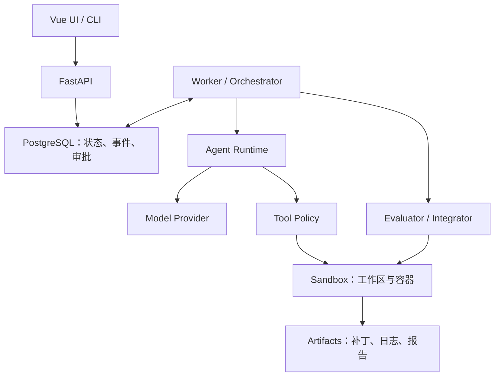
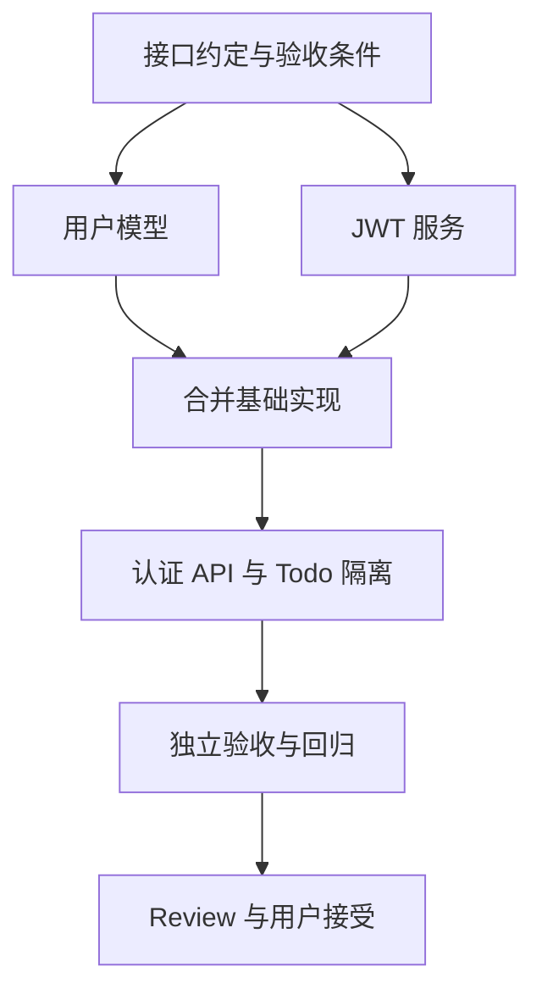

# AgentForge：面向软件工程任务的可靠 Agent Runtime

> 优化版实施方案 · 2026-09-18  
> 定位：个人作品集 / 毕业设计 / 可持续演进的工程项目  
> 技术主线：自研调度内核 + 隔离执行 + 可恢复任务 + 可验证交付  
> 前端：Vue 3 + TypeScript

## 1. 项目目标与边界

AgentForge 接收自然语言开发任务，在指定代码仓库的隔离副本中完成规划、代码修改、测试和有限次数的修复，最终交付可审查的代码 Diff、验证报告和执行记录。

项目的核心问题是：**如何让具有不确定性的模型，在可控预算和权限范围内，可靠地完成软件工程任务？**

多 Agent 是实现手段，其价值必须通过任务完成率、耗时和成本证明。第一阶段先建立可靠的单 Agent 执行闭环，再逐步引入任务图和并行协作。

### 1.1 第一版明确支持

- 单用户、单主机部署；API 与执行 Worker 分离。
- Python / FastAPI 仓库，固定的 pytest 测试环境。
- 通过可信配置指定本地仓库或预先准备的示例仓库。
- 单一模型接入路径，完成工具调用和结构化结果适配。
- 独立工作区、容器内执行、代码 Diff、测试修复、任务取消。
- 持久化执行记录、进程中断恢复和预算控制。
- CLI 驱动核心流程；后续加入 Vue Web 界面。

### 1.2 第一版不做

- 面向任意用户上传恶意代码的公网多租户服务。
- 自动部署生产系统、自动推送远程仓库、操作真实业务数据库。
- 任意语言和任意构建工具的通用支持。
- 十几个角色、Agent 自由聊天、动态模型市场。
- Experience Memory、向量数据库、Browser Agent、复杂语义索引。
- 自研数据库、消息中间件、容器引擎或 Git 实现。

本方案中的默认限额、阶段工作量和验收目标均为设计建议，不代表已经实现或实测达成。

## 2. 相比原方案的关键调整

| 原方案问题 | 优化决策 | 目的 |
|---|---|---|
| Shell 执行早于 Sandbox | V0.1 即加入基础隔离 | 从第一次执行起建立边界 |
| 并行早于代码集成机制 | 先串行，后实现并行、合并与集成验证 | 避免多个 Agent 各自成功而整体失败 |
| Memory、路由、角色数量较多 | 延后增强模块 | 把资源用于闭环质量 |
| 恢复只有概念描述 | 定义 Attempt、租约、工具结果不确定状态 | 明确崩溃后如何继续 |
| DAG 与修复循环混用 | DAG 保持无环，重试属于 Attempt | 保持调度语义清晰 |
| 测试通过即完成 | 基线、受保护验收、版本绑定、人工审查 | 防止失真验收 |
| 技术组件一次性引入 | PostgreSQL 起步，Redis 和 pgvector 按需加入 | 降低维护成本 |
| 缺少量化证据 | 固定任务集与单 Agent 基线对比 | 证明设计带来的收益 |

## 3. 用户流程与交付定义

1. 用户选择仓库，输入目标和验收条件。
2. 系统固定仓库基线提交，创建隔离工作区。
3. 运行基线检查，记录已有测试失败和环境问题。
4. 规划阶段生成结构化任务；Runtime 校验依赖和预算。
5. Worker 执行代码修改，所有工具调用经过权限与执行边界。
6. Evaluator 对候选代码运行受信任的验证配置。
7. 失败时按分类重试、修复或重新规划；达到预算后停止。
8. 交付候选代码、Diff、验证报告、成本统计和未解决问题。
9. 用户审查并接受结果；接受动作不等同于自动推送或部署。

每个 Job 至少交付：

- 基线提交、候选提交与代码差异。
- 需求验收项及各项结果。
- 验证命令、退出码、日志摘要和完整日志位置。
- 工具调用时间线、尝试次数、模型使用量与费用估算。
- 尚未验证、未完成或需要人工判断的事项。

“执行成功”表示候选代码通过该 Job 预设的必需检查；“用户接受”单独记录。Reviewer 的自然语言评价不能代替机器验证，也不能证明不存在安全漏洞。

## 4. 总体架构



### 4.1 模块责任

| 模块 | 负责 | 不负责 |
|---|---|---|
| API | 创建任务、查询状态、审批、取消、事件推送 | 在 HTTP 请求内执行长任务 |
| Orchestrator | Job 生命周期、调度、恢复、预算、终止条件 | 让模型决定系统权限 |
| Agent Runtime | 模型调用、工具循环、上下文管理 | 绕过工具层操作宿主机 |
| Task Graph | 依赖校验、就绪节点计算、计划版本 | 在图中直接添加循环边 |
| Tool Runtime | 参数校验、授权、调用记录、结果截断 | 仅凭命令字符串判断所有风险 |
| Sandbox Manager | 工作区、容器、资源限制、回收 | 向 Agent 暴露 Docker 管理接口 |
| Integrator | 成果合并、冲突检测、生成候选版本 | 自动接受未经验证的合并结果 |
| Evaluator | 基线与验收检查、生成版本化报告 | 把模型自评当作验收依据 |
| 前端 | 展示状态、Diff、审批和交互 | 维护独立于后端的任务真相 |

采用模块化单体：先划清代码边界，避免过早拆成微服务。API 和 Worker 可以是同一代码库中的不同进程。

## 5. 技术栈与自研边界

| 层 | 首选方案 | 选择理由 / 启用时机 |
|---|---|---|
| 后端 | Python + FastAPI | 统一 API、模型适配和执行逻辑 |
| 内部异步执行 | asyncio | 协调模型与工具 I/O；不承担持久化恢复 |
| 调度内核 | 自研状态机 + DAG Scheduler | 项目核心工程能力 |
| 数据库 | PostgreSQL | 事务、状态持久化、并发任务领取 |
| ORM / 迁移 | SQLAlchemy + Alembic | 复用数据库工程能力 |
| 数据校验 | Pydantic | 校验任务计划和工具参数 |
| 隔离 | Docker + 独立工作区 | 从 V0.1 开始 |
| 版本管理 | Git CLI，经受控适配层调用 | 提交、Diff、Worktree 和合并 |
| 前端 | Vue 3 + TypeScript + Vite | 保留既定技术栈 |
| 前端状态 | Pinia | 管理界面状态和后端投影 |
| 图与代码查看 | Vue Flow + Monaco Editor | V1.0 引入 |
| 样式 | Tailwind CSS | 统一界面样式 |
| 实时信息 | SSE + HTTP | 单向事件流和操作请求；交互终端再引入 WebSocket |
| 测试 | pytest + Ruff；类型检查逐步加入 | 项目自身与示例仓库分开配置 |
| 产物 | 本机持久卷 + 数据库元数据 | 后续才迁移到对象存储 |
| 可观测性 | 结构化日志起步 | 跨进程链路复杂后接入 OpenTelemetry |
| Redis | 暂不引入 | 数据库调度出现明确瓶颈或需要跨进程通知时再评估 |
| pgvector | 暂不引入 | 只有检索实验显示收益后再加入 |

PostgreSQL 是本方案的统一选择，并不意味着 MySQL 无法完成该项目。避免为更换数据库增加无关工作量。

自研的是领域逻辑：状态转换、任务依赖、执行尝试、工具协议、恢复规则、合并流程和验收策略。复用的是基础设施：数据库、Git、容器、Web 框架和模型 SDK。

可参考 LangGraph 的持久化和状态组织思想，但第一阶段只实现本项目必需的状态机与调度能力，不追求复刻通用工作流框架。

## 6. 数据模型与状态语义

### 6.1 核心实体

| 实体 | 关键字段 |
|---|---|
| Job | id、request、repository、base_commit、candidate_commit、status、budget、policy_version、accepted_at |
| Plan | id、job_id、version、status、created_by、reason |
| Task | id、job_id、plan_version、title、description、role、status、acceptance、write_scope、input_revision |
| TaskDependency | task_id、depends_on_task_id |
| Attempt | id、task_id、attempt_no、worker_id、lease_expires_at、fencing_token、status、failure_class、started_at、finished_at |
| ToolCall | id、attempt_id、tool、args_hash、idempotency_key、status、execution_handle、exit_code、result_ref |
| Workspace | id、job_id、attempt_id、base_commit、head_commit、container_id、status |
| Event | id、job_id、seq、type、payload、created_at |
| Artifact | id、job_id、attempt_id、kind、path、checksum、revision |
| Evaluation | id、job_id、candidate_commit、environment_digest、policy_version、check_name、status、report_ref |
| Approval | id、job_id、action_digest、candidate_commit、status、expires_at、decided_at |
| ModelCall | id、attempt_id、model、input_tokens、output_tokens、latency_ms、cost_estimate、pricing_version |

不要把所有结果和日志塞进 Task 的一个 JSON 字段。结构化状态便于查询，长日志和补丁保存为产物。

### 6.2 状态定义

- Job：`QUEUED → RUNNING → WAITING_REVIEW → SUCCEEDED`；异常终态为 `FAILED / CANCELLED / BUDGET_EXCEEDED`，等待授权时为 `WAITING_APPROVAL`。
- Task：`PENDING → READY → RUNNING → SUCCEEDED`；失败后根据策略回到 `READY` 或进入 `FAILED`；依赖失败进入 `BLOCKED`；停止执行进入 `CANCELLED`。
- Attempt：`RUNNING → SUCCEEDED / FAILED / CANCELLED / LOST`。
- ToolCall：`PREPARED → RUNNING → SUCCEEDED / FAILED / UNKNOWN`。

Job 的 `WAITING_REVIEW` 表示必需验证已通过、等待用户审查。接受后成为 `SUCCEEDED`；要求修改则回到 `RUNNING`，旧候选的审批和受影响验证失效。

Task 的成功仅表示该节点完成；Job 成功还要求候选版本的全部必需验收通过且用户接受。

状态转换集中定义并校验。禁止在不同模块中任意修改字符串状态。`BLOCKED` 必须带原因，不能让 Job 永久等待无法满足的依赖。

## 7. Task DAG、调度与重新规划

### 7.1 Planner 输出结构化计划

```json
{
  "plan_version": 1,
  "tasks": [
    {
      "id": "T1",
      "title": "确认用户隔离的接口与验收条件",
      "role": "planner",
      "depends_on": [],
      "write_scope": [],
      "acceptance": ["输出接口约定和受影响文件清单"]
    },
    {
      "id": "T2",
      "title": "实现用户模型与认证服务",
      "role": "coder",
      "depends_on": ["T1"],
      "write_scope": ["app/models/", "app/services/"],
      "acceptance": ["提供认证服务接口及对应测试"]
    },
    {
      "id": "T3",
      "title": "接入 API 并实现 Todo 用户隔离",
      "role": "coder",
      "depends_on": ["T2"],
      "write_scope": ["app/routes/"],
      "acceptance": ["用户无法读取或修改他人的 Todo"]
    }
  ]
}
```

Runtime 必须校验：ID 唯一、依赖存在、没有自依赖和环、节点数量有上限、角色合法、路径范围合法、预算可接受。模型产生的计划属于不可信输入。

`write_scope` 是规划声明；真正的写入边界必须由文件工具、挂载权限和执行后 Diff 检查共同实现，不能只依赖 Prompt。

### 7.2 调度原则

- 所有依赖成功后，任务才可能进入 READY。
- 领取任务、创建 Attempt、写入状态事件在数据库事务中完成。
- 初始只允许一个执行 Worker、一个活动 Coder；并发阶段再加入任务租约和互斥规则。
- 数据库是权威状态源；进程内队列只是加速手段，丢失后可重建。
- 多 Worker 使用事务性领取机制，避免相同任务被同时领取。
- 每次领取生成递增 fencing token，旧 Worker 不得发布结果。
- 取消时停止新调度，终止活动执行进程，记录产物并回收资源。

### 7.3 重试与重新规划

重试是在同一个 Task 下创建新的 Attempt；修复代码可以由同一 Coder 的下一次 Attempt 完成。任务拆分或依赖改变时创建新的 Plan 版本。

DAG 始终无环。不能用“Tester 指回 Coder”的依赖边表达循环。

重新规划时保留历史计划，明确哪些成功结果可以复用。只有输入版本、前置条件和相关文件仍适用的结果才能复用；受影响的后续任务必须重新执行。

## 8. Agent、模型与工具接口

### 8.1 角色逐步增加

| 角色 | 职责 | 约束 |
|---|---|---|
| Coder | 搜索、修改、调用本地验证、根据错误修复 | 只能修改获准工作区 |
| Planner | 输出任务计划与接口约定 | 不直接执行任意 Shell |
| Reviewer | 结合需求检查候选 Diff 与验证报告 | 只读；不能修改验收结果 |
| Tester | 后期解释复杂失败与补充测试建议 | 权威测试执行仍属于 Evaluator |

V0.1 只实现 Coder。V0.2 的测试执行是确定性程序，不要求额外创建一个 LLM Tester。不同角色优先复用 Agent Runtime，通过上下文、工具权限和输出 schema 区分。

### 8.2 统一返回对象

AgentResult 至少包含 `status、summary、artifact_refs、proposed_tasks、usage、failure_class`。Agent 只能建议状态变化或新任务，由 Orchestrator 校验并落库。

ToolResult 至少包含 `status、stdout、stderr、exit_code、duration_ms、truncated、artifact_refs、error_code`。完整输出另存产物，模型上下文只接收有长度限制的内容。

### 8.3 首批工具

`read_file、list_files、search_code、apply_patch、run_command、git_diff、git_status、run_tests`。

优先使用可检查的补丁方式修改文件；限制单次读取、输出大小和调用时长。文件路径规范化后检查是否在获准根目录内，并处理符号链接等越界情况。

命令尽可能用结构化 argv 执行；确需 Shell 时仍依赖容器边界和权限策略，不能把命令黑名单当成主要隔离手段。

### 8.4 Model Provider

第一阶段实现一个实际可用的 Provider 和可测试的接口。模型名称、base URL、认证和超时均由配置提供。

接口覆盖工具调用、流式文本、结构化输出、使用量、取消与错误分类。所谓 OpenAI-compatible 只表示兼容某种接口约定，不假设所有服务的工具调用、流式事件和结构化输出行为完全一致。

先验证目标模型的能力，再启用相应功能；能力不足时明确失败或采用预先定义的降级方式。动态模型路由放到有评测数据以后。

## 9. 从 V0.1 开始的执行隔离

### 9.1 初始执行环境

- 以固定 Git 提交创建独立副本或 Worktree；拒绝静默忽略原仓库未提交修改。
- 原仓库存在未提交改动时，明确选择提交、制作包含改动的快照或停止，不直接覆盖用户工作。
- 容器使用非 root 用户；禁止特权模式，禁止挂载 Docker socket。
- 只挂载当前工作区和必要的只读依赖；不挂载宿主机用户目录。
- 限制 CPU、内存、进程数量、运行时间、日志大小和磁盘使用；对不便硬限制的资源至少提供监控与终止阈值。
- 模型调用由容器外 Runtime 完成，API Key 不进入代码执行容器。
- 环境通过预构建镜像和依赖锁定文件固定，记录镜像摘要。
- 初始运行容器默认不访问外网；依赖安装在受控准备阶段进行并记录结果。

Git Worktree 是代码管理手段，不是安全边界。Docker 隔离效果取决于配置，也不等于强多租户安全保证。若未来开放公网执行不可信代码，应重新设计部署边界，并评估更强隔离设施。

### 9.2 审批策略

审批围绕动作影响设计，不应让每次读取和测试都要求点击。

| 动作 | 默认策略 |
|---|---|
| 工作区内读取、搜索、普通代码修改、运行既定测试 | 预授权 |
| 网络下载、添加依赖、修改测试配置或 CI 配置 | 按 Job 策略审批 |
| 访问真实数据库、读取宿主机密钥、特权容器 | 第一版禁止 |
| Git push、生产部署、外部写入 | 第一版不提供对应工具 |
| 接受最终候选代码 | 用户审查后确认 |

审批绑定动作摘要、路径或参数、代码版本和有效期。审批内容发生变化必须重新授权；过期和拒绝均有明确终止或重新规划路径。

## 10. 恢复、幂等与预算控制

### 10.1 恢复边界

模型推理本身不保证可复现。系统恢复的是已经记录的任务、代码版本、工具结果和控制状态，而不是试图恢复模型内部思考。

推荐持久化顺序：先记录调用意图，后执行，再记录结果。即使如此，外部动作与数据库之间仍可能出现结果不确定的窗口，不能宣称实现通用 exactly-once。

| 中断位置 | 恢复策略 |
|---|---|
| 模型请求超时 | 有限重试；记录可能存在重复计费 |
| 补丁已应用、结果未落库 | 比较工作区内容或补丁前后哈希，确认是否已应用 |
| 测试进程仍运行 | 通过执行句柄查询；必要时终止后在干净状态重跑 |
| Shell 已执行、结果未知 | 标记 UNKNOWN，检查实际状态；不能盲目重放 |
| Worker 租约过期 | 停止或隔离旧执行，递增 token，再创建新 Attempt |
| 容器丢失 | 从已持久化代码快照重建；未确认修改标记丢失 |
| 产物写入成功、事务失败 | 恢复时关联或清理未引用产物 |

幂等键只有在执行端实际去重时才有效。对于没有幂等保障、且无法查询结果的有副作用操作，转人工处理或终止。

fencing token 只能阻止旧 Worker 发布有效结果，不能自动停止它写文件。新 Attempt 应使用独立工作区，重调度前确认旧执行已停止或无法影响新工作区。

### 10.2 初始预算默认值

| 项目 | 建议默认值 |
|---|---|
| 单 Job 总时长 | 20 分钟 |
| 单 Job 模型调用 | 最多 40 次 |
| 单 Job 工具调用 | 最多 150 次 |
| 单任务代码修复 | 最多 3 轮 |
| 单 Job 重新规划 | 最多 2 次 |
| 单次普通命令 | 最多 60 秒 |
| 单次测试命令 | 最多 180 秒 |
| 初始 Coder 并发 | 1；并行阶段上限 2 |
| Token / 费用上限 | 启动时配置；每次调用前检查并预留额度 |

这些值需要根据任务集调整。时间、次数、token 和费用限制中，任一达到阈值即停止启动新工作，处理在途调用并输出部分成果。费用估算可能因供应商 usage 延迟而存在偏差，应保留预算余量。

区分模型服务故障、环境故障、代码测试失败、权限拒绝和预算耗尽，避免把所有错误都交给 Coder 修改业务代码。

## 11. 并行协作与代码集成

只有串行闭环和恢复机制稳定后才启用并行。

### 11.1 并行前提

- 依赖已经完成，输入基线明确。
- 接口约定稳定，预期写入范围可以分离。
- 每个写入 Agent 使用独立 Worktree 和执行环境。
- 全局配置、依赖锁文件、数据库 schema 等共享热点默认串行。
- 文本层面的无冲突不代表语义兼容，最终必须集成验证。

### 11.2 成果协议

每个 Coder 交付 `base_commit、result_commit、changed_files、artifact_refs、local_check_results`。工作区必须处于可识别状态，未提交改动不得被当作完整交付。

Integrator 从指定基线创建集成分支，按确定顺序应用成果。合并冲突交由专门的集成修复任务或人工处理，不自动覆盖另一方修改。

Tester / Evaluator 只对合并后的候选提交进行最终验证；分支测试通过仅是局部证据。之后代码发生变化，受影响的验证结果必须失效，最终审批也必须绑定新版本。

## 12. 验收体系与防止虚假完成

### 12.1 三层验证

1. **基线验证**：在修改前记录原有失败、环境问题、测试数量和配置。
2. **任务验收**：针对用户需求运行受保护的验收测试。
3. **回归与工程检查**：按仓库预设策略运行回归、lint、类型检查和必要构建。

并非所有仓库都存在构建步骤或类型检查。检查项应在开始前由可信配置确定；缺少测试不能自动视为通过，Agent 也不能自行降低门槛。

### 12.2 验收保护

- 权威验收测试保存在独立、Agent 不可写的位置。
- 宿主侧 Evaluator 控制命令、输入、超时和结果采集。
- 跟踪删除测试、跳过测试、修改配置和缩小测试范围的变化。
- 允许合理修改测试，但必须单独审查，不能由“全部通过”自动放行。
- 验证报告绑定候选提交、验收套件版本和环境摘要。
- 基线已失败的项目按预定义策略处理，不能由模型自行忽略。

只读测试不能完全抵御恶意代码伪造输出或篡改运行环境。受信任的执行器应检查测试报告格式、实际执行数量和关键行为；面向恶意仓库的评测需要更强的独立验证设计，不属于第一版承诺。

### 12.3 Job 完成条件

- 所有必需任务完成，或由用户明确调整范围。
- 当前候选版本的必需验收和回归检查通过。
- 没有未解决的 UNKNOWN 工具执行或代码合并冲突。
- Reviewer 的阻断项已解决或被用户明确接受并记录。
- 产物完整，用户能够查看 Diff 和失败历史。
- 用户接受当前候选版本。

## 13. Context Engine 与 Memory 的渐进实现

第一版采用：仓库文件树、项目说明、文本搜索、相关文件片段、当前 Diff、失败日志摘要和任务接口约定。

上下文优先级：用户目标与验收条件 > 当前任务及权限 > 接口约定与代码事实 > 最近失败证据 > 历史摘要。

为每一部分设置 token 预算；超限时优先丢弃过期日志、重复输出和低相关片段。保存摘要时同时保存来源文件及版本，避免旧结论被当作当前事实。

Project Memory 初期使用可审查的仓库配置，记录启动、测试、目录约定和限制。Execution History 负责保存事实，不直接把模型生成的“经验”当成可靠知识。

后续先尝试符号索引和依赖关系，再评估 embedding 检索；只有固定任务集上相关性或完成率得到改善，才引入向量库和 Experience Memory。

## 14. Vue 前端与 API

### 14.1 页面优先级

P0：任务列表、创建任务、状态时间线、日志、Diff、验证报告、取消按钮、审批面板。

P1：Vue Flow 任务图、角色执行面板、成本统计、文件查看。

P2：交互终端、复杂图编辑、多项目仪表盘。

第一版 Web 日志使用普通文本展示即可，不必为了展示输出立即加入 xterm.js。交互终端会增加权限和会话管理范围，后续单独设计。

### 14.2 API 草案

| 方法 | 路径 | 用途 |
|---|---|---|
| POST | `/jobs` | 创建任务，支持请求幂等键 |
| GET | `/jobs/{id}` | 查询状态、预算和候选版本 |
| GET | `/jobs/{id}/tasks` | 查询当前计划和任务 |
| GET | `/jobs/{id}/events` | SSE 事件流，支持游标续传 |
| GET | `/jobs/{id}/artifacts` | 获取产物元数据 |
| GET | `/jobs/{id}/diff` | 查看候选代码差异 |
| POST | `/jobs/{id}/cancel` | 请求取消 |
| POST | `/jobs/{id}/approvals/{approval_id}` | 提交批准或拒绝 |
| POST | `/jobs/{id}/accept` | 接受指定候选提交 |
| POST | `/jobs/{id}/request-changes` | 提交修改要求 |

事件包含单调递增序号。前端重连后从游标补齐并去重；事件过期则重新获取状态快照。数据库中的状态变更和事件写入使用同一事务，避免界面收到不存在的状态。

默认本机访问。对外提供界面前必须加入身份认证和访问控制；日志、Diff 与产物只向有权访问该 Job 的用户开放。

## 15. 工程结构与开发约定

```text
agentforge/
  apps/
    api/                    # FastAPI 接口与事件输出
    worker/                 # Worker 进程入口
    cli/                    # 早期端到端入口
    web/                    # Vue 3 应用
  src/agentforge/
    domain/                 # 实体、状态转换、失败分类
    orchestration/          # 调度、租约、恢复、预算
    planning/               # DAG 校验和计划版本
    agents/                 # 通用运行循环、角色配置
    providers/              # 模型适配
    tools/                  # 工具协议与实现
    sandbox/                # 容器、工作区、执行句柄
    integration/            # 补丁、提交、合并
    evaluation/             # 基线、验收、报告
    context/                # 搜索、裁剪、摘要
    persistence/            # SQLAlchemy、事务、仓储
    telemetry/              # 日志、调用量与事件
  migrations/
  docker/
  examples/fastapi-todo/
  benchmarks/
    tasks/                  # 固定任务描述与基线
    acceptance/             # 受保护验收套件
  tests/
    unit/
    integration/
    recovery/
  docs/
    decisions/              # 关键架构决策
  pyproject.toml
  compose.yaml
  README.md
```

统一术语：Job 是一次请求，Task 是逻辑任务，Attempt 是一次执行尝试，Plan 是版本化任务图，Candidate 是待验收提交。

配置与密钥分离；示例配置只提供变量名，不提交真实凭据。日志默认脱敏，避免将密钥和完整私密代码无差别发送到可观测平台。

## 16. 分阶段实施计划

以下以单人、已有 Python 和 Web 基础为假设，按有效工作日估算，不包含系统学习、等待模型额度等时间。每阶段完成验收后再进入下一阶段。

| 阶段 | 建议工作量 | 内容 | 必须通过的验收 |
|---|---|---|---|
| V0.1 最小执行闭环 | 5–8 天 | CLI、一个 Provider、Coder、文件/命令工具、容器、Diff、基础预算 | 在隔离环境修复预设 bug；超时和取消有效；原仓库不被直接修改 |
| V0.2 可靠闭环 | 7–10 天 | PostgreSQL、Attempt、事件、基线/验收、有限修复、恢复 | 测试失败可修复；中断后可恢复；不确定动作不盲重放 |
| V0.3 计划与串行调度 | 5–8 天 | Planner、DAG 校验、串行 Scheduler、Reviewer、审批 | 拒绝循环计划；依赖失败正确阻断；重规划有上限 |
| V0.4 受控并行 | 7–10 天 | 独立 Worktree、最多两个 Coder、Integrator、集成测试 | 两个分支成果正确合并；冲突可见；合并后重新验证 |
| V1.0 可展示版本 | 7–10 天 | Vue UI、任务图、Diff、事件重连、任务集评估、文档 | 完整 Demo；公开复现实验方法、结果及局限 |

总参考工作量约 31–46 个有效工作日。建议另外预留约 20% 时间处理模型行为、环境和集成问题。若时间不足，做到 V0.3，并提供薄版 Vue 界面及评测报告，即可形成边界清晰的作品；并行调度作为后续扩展。

### 16.1 最先完成的十项任务

- [ ] 定义 Job、Task、Attempt 和失败分类。
- [ ] 准备固定版本的 FastAPI Todo 示例仓库和环境镜像。
- [ ] 实现隔离工作区创建、销毁和超时清理。
- [ ] 接入一个模型，验证工具调用及错误处理。
- [ ] 实现读取、搜索、补丁、命令执行和 Diff 工具。
- [ ] 实现带轮数和时间预算的 Coder 循环。
- [ ] 跑通一个真实 bug 修复，并输出可审查产物。
- [ ] 加入基线和受保护验收测试。
- [ ] 加入 PostgreSQL 执行记录及中断恢复。
- [ ] 再加入 Planner 和 DAG；此时仍串行运行。

## 17. 测试策略与量化评估

### 17.1 项目自身的关键测试

| 类别 | 重点验证 |
|---|---|
| 状态与 DAG | 环检测、依赖缺失、非法转换、依赖失败传播 |
| 调度 | 重复领取、租约过期、旧 Worker 发布结果被拒绝 |
| 工具与权限 | 路径越界、符号链接、输出限额、拒绝未授权动作 |
| 恢复 | 执行前崩溃、执行后落库前崩溃、数据库暂时不可用 |
| 预算与取消 | 不再启动新任务、在途执行停止、终态正确 |
| 代码集成 | 文本冲突、语义回归、错误基线、验证结果失效 |
| 事件与审批 | 断线补齐、重复事件、过期审批、版本不匹配 |

核心确定性逻辑使用 Mock Provider；少量端到端测试调用真实模型。不要让每次普通代码提交都依赖昂贵、波动较大的全套真实模型测试。

### 17.2 固定任务集

先建立 12 个小型任务：4 个 bug 修复、4 个功能增加、2 个带回归约束的重构、2 个故障恢复场景。每个任务固定基线提交、环境、需求和验收条件。

不要只展示成功案例；保留失败日志和人工介入记录。故障恢复场景单独统计，不与编码任务混为一个成功率。

### 17.3 对照组与指标

- A：单 Coder + 固定测试闭环。
- B：Planner + 串行 DAG + Coder + Reviewer。
- C：在 B 基础上启用受控并行。

使用相同任务、模型、环境及单 Job 预算。最终比较每个编码任务每组至少运行 3 次；样本较小时明确结果仅是项目内部实验，避免泛化结论。

| 指标 | 计算方式 |
|---|---|
| 自动完成率 | 无人工修复且通过独立验收的运行数 / 总运行数 |
| 端到端耗时 | 从 Job 启动到结果可审查；等待人工时间另列 |
| 成本 | token 用量及对应价格版本下的费用估算 |
| 人工介入 | 每次运行的批准、澄清、人工修复分别计数 |
| 恢复成功率 | 注入中断后正确继续或安全终止的场景比例，二者分列 |
| 合并冲突率 | 出现冲突的并行 Job / 并行 Job 总数 |
| 并行收益 | 同任务串行耗时 / 并行耗时，同时报告额外成本 |
| 验收缺陷 | 声称完成但独立验收失败的数量 |

不预先宣称多 Agent 更优。若 B 或 C 增加成本却没有改善完成率或时延，应把适用边界写入结论，并允许按任务复杂度使用单 Agent 路径。

## 18. 最终演示设计

### 18.1 演示任务

> 为 FastAPI Todo 项目增加用户注册与 JWT 登录。Todo 必须归属用户，用户不能读取、修改或删除其他用户的 Todo。补充对应测试，保留已有功能。

验收条件至少包括：注册与登录成功路径、错误密码、无效或过期凭证、未认证访问、用户间数据隔离，以及既有 Todo 行为回归。

### 18.2 正确的任务依赖



T2 与 T3 只有在接口和写入边界已明确时才并行；API 实现必须等待依赖成果集成。验收失败通过新 Attempt 或新 Plan 处理，不在上述 DAG 中添加回边。

### 18.3 演示三个场景

1. **正常完成**：需求输入、计划、修改、测试、Diff 和用户接受。
2. **失败修复**：预置可复现的失败，展示分类、有限修复和重新验收。
3. **进程恢复**：在预设边界中断 Worker，重启后展示恢复证据和避免重复副作用的行为。

并行合并作为第四个增强场景。所有演示日志来自实际执行，不用硬编码的成功文本代替结果。

## 19. 主要风险与应对

| 风险 | 应对 |
|---|---|
| 项目范围失控 | 以 V0.3 为首个正式交付，增强功能单列 backlog |
| 模型输出不稳定 | schema 校验、工具结果约束、预算、固定任务集 |
| 环境安装耗时与失败 | 固定镜像、依赖锁定、区分环境错误与代码错误 |
| 多 Agent 修改冲突 | 默认串行，接口约定、独立工作区、专门集成流程 |
| 恢复导致重复副作用 | 记录执行意图、查询实际结果、不确定操作不盲重试 |
| 容器资源残留 | 标签化资源、超时回收、启动时扫描孤儿资源 |
| 测试失真 | 保护验收、核查执行数量、绑定代码与环境版本 |
| 前端开发挤占核心时间 | CLI 先行，先实现状态、Diff 和审批，再做图形增强 |
| 无法证明多 Agent 价值 | 单 Agent 对照组，公开成本和失败案例 |

## 20. 项目展示与完成标准

作品集建议表述：

> 实现了面向软件工程任务的 Agent Runtime，支持版本化任务图、隔离代码执行、持久化执行尝试、故障恢复和受控代码集成，并通过独立验收和固定任务集评估系统表现。

只写已经完成并验证的能力。不要使用尚无证据支持的“通用 Agent 操作系统”“完全安全”“自主完成所有开发任务”等表述。

最终交付清单：

- [ ] 可启动的后端、Worker、Vue 前端及示例环境。
- [ ] 清晰的安装步骤、示例配置和密钥配置说明。
- [ ] 正常、修复、恢复三种真实演示。
- [ ] 任务模型、状态机、恢复策略及关键架构决策文档。
- [ ] 固定任务集、独立验收、运行方法和评测报告。
- [ ] 代码 Diff、日志、版本绑定的验证报告。
- [ ] 已知限制、失败案例与后续路线。

项目的首要成功标准是：**在限定范围内，执行过程可追踪、失败可处理、结果可验证；复杂度来自必要机制，而不是角色和组件的数量。**
