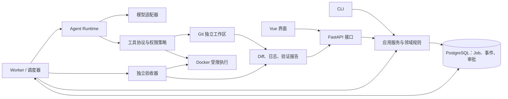

# AgentForge 最终目标

> 本文同时说明最终目标与当前实现；目标架构中的规划部分不代表已经完成。当前完成 M0–M6，下一步是 M7。具体状态、依赖和验收顺序见 [阶段目标.md](阶段目标.md)。

## 一、项目要解决的问题

AgentForge 是面向软件工程任务的 Agent 运行平台。用户给出代码仓库、开发目标和验收条件后，系统在独立工作区中让 Agent 阅读代码、提出修改、运行受控工具，并用独立于模型的检查验证结果。最终交付代码差异、测试报告、执行记录和未解决问题，由用户决定是否接受。

核心问题是：**怎样让输出不确定的模型，在明确的权限、时间和费用范围内，完成可追踪、可恢复、可验证的代码任务。** 项目重点是运行机制和工程可信度，多个 Agent 只在确有收益时加入。

## 二、最终使用效果

用户应能够完成以下流程：

1. 选择已授权的本地 Git 仓库，填写任务目标、允许修改的范围和验收条件。
2. 系统固定仓库基线，建立独立工作区，先记录原仓库的测试状态。
3. 单个 Coder 或经校验的任务计划在预算内执行；用户能查看当前步骤、工具调用、失败和消耗。
4. 需要更高权限的动作先请求审批；拒绝或过期后不继续执行该动作。
5. 系统对候选代码运行预先确定的验收与回归检查。失败时有限修复；超时、取消、预算耗尽或结果不明时给出明确状态。
6. 用户查看代码 Diff、测试证据、执行时间线和剩余风险，再接受或拒绝候选结果。

每次任务至少交付：基线提交或快照标识、候选代码版本、变更文件与 Diff、检查命令和结果、完整日志位置、模型与工具使用量、失败历史及未验证事项。系统不能用模型自评或一段“已完成”的文字代替测试证据。

可演示的最终效果包括：在固定的 FastAPI Todo 示例仓库中修复一个缺陷、完成一个有明确验收条件的小功能，以及在 Worker 中断后安全恢复或终止。演示要保留真实失败记录。

## 三、范围与边界

首个完整产品面向**单用户、单主机、受信任的 Python/FastAPI 目标仓库**。它允许用户审查候选代码，不自动推送远程仓库，也不自动部署生产环境。不把 Docker 容器宣称为可承载任意恶意租户代码的安全边界。

主要后端采用 Python：领域规则、应用服务、Agent Runtime、Worker 和 FastAPI 接口在同一代码库中。FastAPI 负责短请求和状态查询；耗时任务由独立 Worker 进程执行。当前规划不增加 Java 主后端或第二套业务服务。

## 四、项目架构

下图是**目标架构**。目前已有 Job 规则、内存存储、本地 CLI、独立 Todo 示例、Git 工作区管理和固定测试容器执行器；AgentForge 的 API、Worker、模型运行循环、通用工具协议、验收器与 Web 界面仍待实现。

这是**模块化单体**：一套 Python 业务代码，按职责分模块；API 与 Worker 可以是不同进程，但共享同一套领域规则和数据契约。各部分职责如下。

| 部分 | 负责 | 关键边界 |
|---|---|---|
| 领域与应用服务 | Job 状态、任务创建、取消和业务用例 | 不依赖 HTTP、数据库表或模型 SDK 的具体写法 |
| FastAPI | 输入校验、创建任务、查询结果、审批与事件接口 | 不在 HTTP 请求里等待完整代码任务结束 |
| Worker / 调度器 | 领取任务、记录 Attempt、预算、重试、恢复 | 状态改变由程序校验，不由模型直接决定 |
| Agent Runtime / 模型适配器 | 模型调用、工具循环、上下文整理 | 模型只能建议动作，不能绕过工具权限 |
| 工具与执行环境 | 文件读取、搜索、补丁、测试、Git 操作 | 只作用于获准工作区；运行代码经过受限容器 |
| 验收器 | 基线、受保护验收、回归检查与报告 | 验收条件在任务开始前确定，不能由 Agent 自行降低 |
| Vue 界面 | 展示进度、Diff、报告和审批操作 | 展示后端事实，不自行判定任务成功 |

### 当前实现与调用关系

| 已实现部分 | 位置与技术 | 当前调用关系和边界 |
|---|---|---|
| Job 规则与服务（M1–M3） | `src/agentforge/job_management/` 中的 `model.py`、`status.py`、`repository.py`、`service.py` 使用普通 Python `enum`、`dataclass` 与存储协议 | `job_management.cli → JobService → Job 规则 / InMemoryJobRepository`；存储协议提供 `create/get/update_status`，数据在进程退出后丢失，M15 才引入持久化；执行演示由确定性假实现产生 |
| Todo 示例（M4） | `examples/todo_fixture/` 是 FastAPI/Pydantic 模板，`scripts/create_todo_baseline.py` 从模板生成独立的本地 Git 仓库；完整 SHA-1 提交记录在 `examples/todo_baseline.commit` | 它是受管理的目标仓库，不是 AgentForge 的 HTTP 服务；基线保留一个“缺失 Todo 返回 200 而非 404”的预置失败测试 |
| Git 工作区（M5） | `src/agentforge/workspace_management/manager.py` 用标准库调用本机 `git worktree`；`cli.py` 输出 JSON；生命周期记录存于 `.local/workspaces/.records/` | `workspace_management.cli → WorkspaceManager → Git / JSON 记录`；从 M4 固定提交建立隔离目录，拒绝带未提交修改的来源仓库，清理前检查候选文件、忽略文件和新增提交，清理后保留记录 |
| 固定测试容器（M6） | `containers/todo-test/Dockerfile` 安装 Todo 的锁定依赖；`src/agentforge/container_execution/` 用 Docker CLI 运行固定 pytest，并输出 JSON 结果；日志存于 `.local/workspaces/.runs/` | `container_execution.cli → ContainerTestRunner → WorkspaceManager / Docker`；只接受活动的 M5 工作区，检查本地镜像并固定其完整镜像 ID；将候选目录只读挂载到非 root、只读根文件系统、禁用网络的容器，限制为 1 CPU、512 MiB 内存、64 个进程；记录超时、退出码和日志。此时尚无通用命令工具或独立验收器 |

顶层 `src/agentforge/__init__.py` 只注册旧测试所需的导入映射；现有实现分别位于 `job_management/`、`workspace_management/` 和 `container_execution/`。CLI 分别使用 `python -m agentforge.job_management.cli`、`python -m agentforge.workspace_management.cli` 和 `python -m agentforge.container_execution.cli`。`.local/workspaces/` 是运行时数据目录，与 `workspace_management/` 代码包不同。

主要数据概念：`Job` 是一次用户请求；`Task` 是计划中的逻辑工作；`Attempt` 是一次执行尝试；`Candidate` 是待验收的代码版本。计划可采用无环任务图；测试失败后的修复用新的 Attempt 表达，不在任务图中添加循环依赖。

后续验收器将区分基线缺陷、环境故障和新回归，并让摘要引用完整日志。Worker 将记录租约、执行世代与动作结果；Web 进度流需要断线补齐。Reviewer 只读审查，多个 Coder 使用各自的工作区，集成结果须重新验收。各部分的实施顺序与完成标准见 [阶段目标.md](阶段目标.md)。

## 五、技术栈如何使用

技术选择按阶段引入；下表描述最终用途，不要求项目起步时全部安装。库的具体版本在实施对应阶段时锁定并验证。

| 技术 | 在 AgentForge 中的用途 | 引入时机 |
|---|---|---|
| Python、标准库 `enum` / `dataclasses` | 状态规则、领域对象、应用服务、Agent Runtime | 从领域模块开始；核心规则保持普通 Python |
| pytest、Ruff | 行为测试、回归检查、代码规范 | 从第一个领域规则开始 |
| Git / Worktree | 固定基线、隔离修改、生成 Diff 与候选版本 | 执行目标仓库任务前 |
| Docker | M6 已在受限容器中运行固定 Todo pytest，限制资源与权限；后续工具调用复用受控执行环境 | 固定测试执行器已引入；通用工具尚未开放 |
| 模型 Provider SDK | 接入一个真实模型，处理工具调用、超时和使用量 | 确定性工具与验收可用后 |
| PostgreSQL、SQLAlchemy、Alembic | 持久化任务与事件、事务处理、数据库结构迁移 | 单 Agent 本地闭环稳定后 |
| FastAPI、Pydantic | HTTP 接口；校验请求、响应和外部结构化数据 | 应用服务和持久化稳定后；Pydantic 不代替领域状态规则 |
| Vue 3、TypeScript、Vite | 任务页面、进度、Diff、报告及审批界面 | 后端接口稳定后 |
| SSE | 后端向页面单向推送任务事件；控制操作仍用 HTTP | 界面需要实时进度时 |

[FastAPI](https://fastapi.tiangolo.com/tutorial/body/) 使用 Pydantic 描述和校验请求数据；[SQLAlchemy](https://docs.sqlalchemy.org/en/20/orm/session_basics.html) 管理数据库会话与事务，[Alembic](https://alembic.sqlalchemy.org/en/latest/tutorial.html) 管理迁移。[Git Worktree](https://git-scm.com/docs/git-worktree) 用于独立工作目录，[Docker 资源限制](https://docs.docker.com/engine/containers/resource_constraints) 用于约束代码执行。[Vue 与 TypeScript](https://vuejs.org/guide/typescript/overview) 用于后期界面。

Redis、向量数据库、动态模型路由和独立 Java 服务不属于默认技术栈。只有固定任务集表明需要它们时，再单独设计并比较收益与维护成本。

### 存储、通信与部署边界

当前的 Job 只保存在进程内存；本地 Git 仓库保存代码基线，M5 的 JSON 仅保存工作区来源与生命周期，**不是** Job 的权威数据库。当前通信是 CLI 调用 Python 模块、工作区管理器调用本机 Git、M6 执行器调用本机 Docker CLI。固定测试需要本地 Docker Engine 和已构建的 Todo 镜像；执行器只读挂载活动工作区，不挂载来源仓库、宿主密钥或 Docker socket。AgentForge 尚无服务端、网络接口或通用命令工具。

目标状态由 PostgreSQL 保存 Job、Attempt、事件和审批，文件系统保存工作区、Diff、日志与报告并通过受控路径引用。浏览器通过 HTTP 提交操作、通过 SSE 接收进度；API 与 Worker 通过数据库协调，Worker 经模型适配器调用 Provider，并在受限 Docker 容器中执行目标代码。目标为单主机部署 API、Worker、PostgreSQL、Docker 和 Vue 静态资源，不自动推送或部署用户代码。

## 六、可靠性与验收要求

- **隔离**：原仓库不被 Agent 直接修改；目标代码在独立工作区，但 Git 工作区本身不是执行安全边界；执行容器不挂载宿主机密钥或 Docker socket，设置时间与资源上限。
- **权限**：工具参数、路径和写入范围经过校验；网络下载、依赖变化和影响验收规则的修改需要明确策略与审批。
- **可恢复**：先记录动作意图，再执行并记录结果。崩溃后区分“未执行”“已执行”和“结果未知”；有副作用且结果未知的动作不能盲目重放。
- **预算与终止**：限制模型调用、工具调用、时间和费用估算；任一上限到达、用户取消或无法安全继续时停止启动新动作并交付已有证据。
- **独立验证**：记录修改前基线；使用受保护的验收配置检查候选版本；测试结果绑定代码版本与环境，代码变化后相关结果失效。
- **用户接受**：机器检查通过与用户接受是两个事件。系统展示所有阻断项与未验证事项，由用户作最终决定。

完整目标的验收标准是：固定任务集可以复现运行，任务状态和失败原因可追踪，单 Agent 能在受限工作区交付候选代码，进程中断能安全处理；计划和并行能力在独立工作区与集成验收下运行，并能用完成率、耗时、成本和人工介入数据评价其价值。

## 七、项目最终交付物

- 可启动的 CLI、FastAPI、Worker 和 Vue 界面，以及必要的数据库迁移与受限执行配置。
- 固定提交的示例目标仓库、受保护验收用例和可重复执行的演示步骤。
- 正常完成、失败后修复、中断恢复、计划执行和并行集成的真实运行记录。
- 每次运行可查询的代码 Diff、验证报告、日志、预算消耗和人工审批记录。
- 固定任务集与对照评测报告，说明成功案例、失败案例、成本及已知限制。

只有这些交付物经过实际运行和检查，项目才能把相应能力写成“已实现”。
