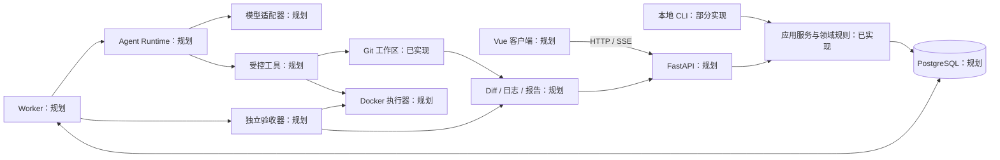

# AgentForge 项目最终架构

本文是目标架构与当前实现的对照。产品目标与边界见 [最终目标.md](最终目标.md)，实施顺序见 [阶段步骤实现.md](阶段步骤实现.md)。首个完整产品面向单用户、单主机、受信任的 Python/FastAPI 代码仓库；由用户审查候选结果。

## 架构依据与主要数据流

模型输出不可直接当作任务完成证据。平台先固定 Git 基线并建立独立工作区，再在权限和预算内调用工具；受信任的验收器运行预先确定的检查，最后把 Diff、日志和验证结果交给用户。HTTP 请求保持短时，耗时任务由 Worker 执行。模块化单体共用一套 Python 领域规则，避免 CLI、API 和 Worker 出现不同的状态判断。

## 组成部分、职责与技术

当前 Python 代码以功能为一级边界：`src/agentforge/job_management/` 包含 `model.py`、`status.py`、`repository.py`、`service.py` 和 `cli.py`；`src/agentforge/workspace_management/` 包含 `manager.py` 和 `cli.py`。Job CLI 调用 Job 服务，服务通过存储协议操作 Job；工作区 CLI 调用管理器，管理器调用本机 Git 并保存本地 JSON 记录。两个功能目录没有相互依赖。顶层 `agentforge/__init__.py` 只注册旧测试所需的导入路径映射，不放 Job 或工作区业务实现。后续功能在所属目录实现。

| 部分与状态 | 目的与职责 | 接口、关系和技术应用 |
|---|---|---|
| Job 领域与应用服务：已实现 M1–M3 | 表达任务状态和合法跃迁；创建、查询、取消与确定性假执行 | `agentforge.job_management` 中的 model、status、repository、service 使用普通 Python `enum`、`dataclass` 与 `JobRepository` 协议；Job CLI 调用 `JobService`，不依赖 HTTP、数据库或模型 SDK |
| 内存存储：已实现 M2 | 保存单进程演示中的 Job | `InMemoryJobRepository` 实现 `create/get/update_status`；进程退出即丢失，持久化留给 M15 |
| 本地 CLI：已实现部分 | 演示 Job 生命周期，创建、查询和清理 Todo 工作区 | `agentforge.job_management.cli` 调用 Job 服务；`agentforge.workspace_management.cli` 调用工作区管理器，使用 JSON 输出记录；旧导入路径保留，旧 `python -m` 入口改用功能目录路径 |
| Todo 示例与固定基线：已实现 M4 | 提供可复现的代码任务和故意保留的缺陷 | FastAPI/Pydantic 只在示例的 HTTP 边界使用；模板生成独立 Git 仓库，完整 SHA-1 提交记录在 `examples/todo_baseline.commit` |
| Git 工作区管理：已实现 M5 | 从固定提交隔离候选代码，记录来源与生命周期，避免清理丢失改动 | `agentforge.workspace_management.manager` 用 Python 标准库调用 `git worktree add/remove`；JSON 记录位于 `.local/workspaces/.records/`；检查来源未提交修改和工作区文件、忽略文件及新增提交 |
| 容器执行与工具协议：规划 M6–M8 | 受控读取、修改、搜索、测试目标仓库 | Docker 限制用户、时间与资源；工具只接收获准工作区路径，测试命令预先指定；Git 工作区本身不是执行安全边界 |
| 验收器与产物：规划 M9–M10 | 区分基线缺陷、环境失败和新回归，保留候选 Diff 与完整证据 | pytest 由验收器在容器中调用；Git 生成变更列表与 Diff；摘要引用完整日志 |
| Agent Runtime 与模型适配：规划 M11–M13 | 在轮数、时间和工具预算内处理模型建议，驱动一次代码任务 | 假模型先验证流程，再接一个真实 Provider；模型只能请求工具，不能改变受保护的验收规则或系统终态 |
| 持久化与 Worker：规划 M14–M18 | 跨进程保存 Job、Attempt、事件和预算；执行长任务与恢复 | PostgreSQL 为权威状态源，SQLAlchemy 处理事务，Alembic 管理迁移；独立 Python Worker 领取任务并记录租约、世代和动作结果 |
| FastAPI 服务：规划 M19 | 提供创建、查询、取消和产物接口 | Pydantic 校验 HTTP 输入输出；复用应用服务；HTTP 不等待完整 Agent 执行 |
| Vue 客户端：规划 M20–M22 | 展示任务、进度、Diff、报告和审批 | Vue 3、TypeScript、Vite；HTTP 提交操作，SSE 推送进度并支持断线补齐；以服务端事实为准 |
| 计划与协作：规划 M23–M28 | 在单 Agent 可靠后加入 DAG、Reviewer、受控并行与评测 | 程序校验依赖图和权限；并行写入各自工作区，集成后重新验收；固定任务集比较效果 |

## 存储、通信和部署边界

当前只有进程内 Job 存储、本地 Git 仓库和工作区 JSON 记录。M5 的 JSON 不是 Job 权威数据库；它只记录本机工作区来源与生命周期。目标状态由 PostgreSQL 保存任务、尝试、事件和审批，文件系统保存工作区、Diff、日志与报告，并通过受控路径引用。

当前通信只有本地 CLI 对 Python 模块的函数调用，以及管理器调用本机 Git；没有 AgentForge 服务端和网络接口。目标通信为浏览器与 FastAPI 间的 HTTP/SSE、API 和 Worker 通过数据库协调、Worker 通过模型适配器调用 Provider，以及工具通过受限容器执行目标代码。

当前部署方式是本地 Python 虚拟环境，需 Git 但不需数据库或 Docker。目标单主机部署运行 API、Worker、PostgreSQL 和 Docker；客户端由 Vue 静态资源提供。部署目标不包含自动推送或生产发布，也不把 Docker 视为任意恶意租户代码的完整安全边界。
